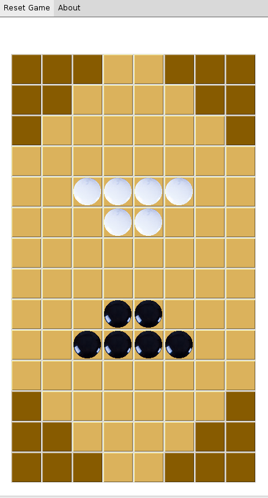
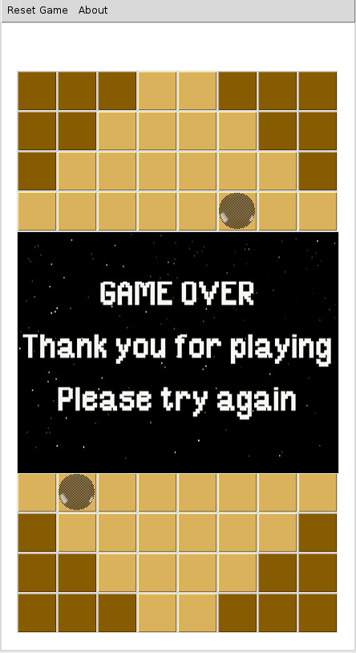

## Artificial Intelligence Programming Assignment

#### How to Run
* Prepare the run
 * Install Python 2.7
 * Install Tkinter 
 * Install unittest
 * Install nosetest
 * Install pylint

* Run the game
```
$ python ./playcc.py
```

#### How to Test
We use unittest and nosetest to test this code base
```
$ nosetests
..........
----------------------------------------------------------------------
Ran 10 tests in 0.050s

OK
```

#### Coding Validation
the source code of this project is formatted with Google yapf (https://github.com/google/yapf)
with the following settings:

$ yapf --style yapf.ini
```
[style]

based_on_style = google
indent_width = 2
split_before_logical_operator = true
```

the source code of this project is checked with pylint (http://www.pylint.org)
with the following settings:
```
$ pylint --disable=locally-disabled --max-line-length=100 --indent-string='  ' *.py
```

#### Documentation
Below are some documentation for the source files
* 
* 

#### Screenshot

* game launch screen<br>


* game end screen<br>


