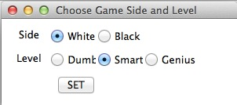
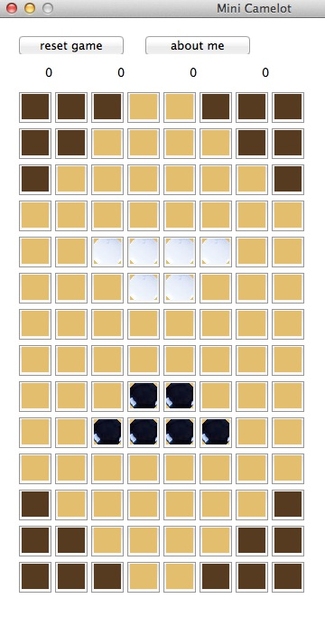

##Report of Mini Camelot Project
Caicai CHEN 
May 3, 2015

#### Programming Language

  Python 2.7

#### How to run

	Install Python 2.7

	Install Tkinter

	$ python ./playcc.py

#### How to play

1. Choose Side and Level

	After running playcc.py, you will see the window below:
	
		

	- Choose White or Black for the human player. White always goes first.  
	- Choose difficulty level for the robot. Dumb, Smart to Genius are with increasing difficulty.
	- Click SET to start the game

  ###### Note: 
  - If White is chosen, the game with start with the default canvass and wait for the first move of the human player.
  - If Black is chosen, meaning the robot is playing the white. The robot player will start with the default game canvass and proceed with its first move. The human player may surprisingly observe the game canvass in a non-default mode before the first move.
	
2. How to play	

  ##### Terms
  - Cell Status
   - Disabled: The 6 cells on each corner. Those cells are not be able to hold any game piece.
   - Free: It is a legitimate cell on the game canvass. But it is not taken by any piece of the players.
   - Player: It is a legitimate cell on the game canvass. But it is taken by either white or black player.

  ##### Game Moving Rules
	- Step 1: Select one of your own piece on the canvass when it is on your turn to play
    - You can select the piece by single clicking the mouse
    - When you by mistake choose one move before you make the move, you can de-select it by another single click on the same piece.
    - When it is robot playing time, you may end up being unable to select any piece of your own.
    - When one piece is selected, that piece will have highlighted background color.
	- Step 2: Click the next cell you want to move
    - This is the first move, you can either proceed with a plain move or leaped move to a free cell.
    - If your move is not legitimate, there will be notification one the screen
    - If you would like to end at the first move, go to Step 4
    - If you would like to continue with leaped move, go to Step 3
	- Step 3: Click the next cell you want to move
    - You can leap over your own piece or rival piece
    - If you leap over a rival piece, that rival piece will be taken off from the canvass
    - If you want to keep leaping, keep doing step3
    - When you want to finish the move, to to step4
	- Step 4: Click the cell you want to stop with
    - At this point the cell should be in selected state
    - Just simply click it one more time to end the move
    - The game play right will be handed over to the robot immediately
	
#### Sample Canvass Map
  	

####About Design:####

1. Cutoff

	Pass the parameter `level` to alpha-beta algorithm. 
	When passing to next level, level - 1.
	Stop when level = 0, call evaluation function
	
2. Evaluation function

	My evaluation function consist of four part: (The coefficients are empirical)
	- Distance to castle (Coefficient: 1)
		- Squared (14 - distance), the closer, the higher utility.
		- It encourages Robot player move the piece near to castle, if two piece under the same circumstances.
	- Penalty of being captured (Coefficient: 30)
		- It courages robot to capture enemy piece and avoid been captured.
	- Penalty of stoping beside a enemy piece (Coefficient: 0)
    - Avoid been captured in the next move of enemy
	- Penalty of far away from center (Coefficient: 2) 
		- Encourages Robot choosing more central cell
	- Different levels of difficulty
		- Using cutting-off level to set different level of difficulty 
    - Dumb: level = 1
		- Smart: level = 2
		- Genius: level = 3

3. Smart learning cache

  - Purpose of the smart cache
    - As the thinking time of the robot is non-trivial, especially in Genius mode(level 3), the smart learning cache is introduced to speed up the thinking time of the robot.
  - How smart learning cache works
    - Generally, the cache comes from pre-learning and active-learning
    - pre-learning is that we simulate the canvass maps and precalculate the optimum move results based on the canvass map scenarios. 
    - active-learning is the compliment of the pre-learning cache. In active-learning, every play that is with a smart-cache-miss will trigger a real-time optimum move calculation. Then this optimum result associated with the canvass map will be stored in the cache. When the same canvass map appears again, it will be a cache hit.
  - How it is implemented
    - Python pickle file is used to store the Python dictionary format.
    - At each game start, the whole cache will be loaded from the pickle file.
    - At each turn of robot play, cache is checked. With cache hit, the cached result will be fetched.
    - When there is a cache miss, a real-time optimum move will be calculated. Then this result will be appended into the cache.
	
