## Optimizing Mini Camelot Game with caching service

###### Robert Wen <robert.wen@nyu.edu>, N12246277, qw476

### Introduction

Mini Camelot is a simplified version of a board game Camelot. It has white and black players on each side of the game canvass. Each player has to follow specific moving rules to move their own pieces. In order to maximize the game success rate, artificial intelligence algorism is used in evaluating the optimal moving strategy. However, the calculating time, a.k.a thinking time of the robot player, takes seconds with moderate evaluation level. In this project I am trying to eliminate the thinking time for this Mini Camelot game to an unnoticable level, by pre-calculating the gaming results on Amazon EMR (Elastic Map Reduce) service and store them on local MongoDB for fast cached result query. The design of the data format transformation, as well as how the map-reduce is implemented are elaborated. Also the running progress of the EMR job is recorded for reference. To evaluate the impact of this proposed idea, a benchmark is designed to compare the performance with and without the cache. Lastly the further opportunites of this idea is discussed. 

There are two objectives for this project. One is to eliminate the thinking time of the robot player as much as possible through the pre-calculated cache. This is transparently integrated into the original game UI hence there is no output except for the benchmark result. The other is to setup a web based UI for user to query a specific canvass map and get the next optimal game move strategy in a GIF animation.

Here is the user interface of the Mini Camelot Game:


For more details about the camelot game, you can refer to http://en.wikipedia.org/wiki/Camelot_(board_game) or http://www.iggamecenter.com/info/en/camelot.html

### Game Cache Layer Design

##### Cache Layer Introduction

The original mini Camelot game does not have game result cache layer. It calculates the game moving strategy based on the current game canvass on the fly. Here I design the game cache layer as a transparent cache service to the game engine. As the cache needs external database queries, the game is not designed to be fully dependent on the cache layer. If the cache query is not successful, the game will calculate the result on-the-fly. This ensures the availability of the game while maximize the usage of the cache. The other reason to keep the calculating power of the game but not fully depends on the game cache is that the combinations of the game canvass is incredibly high. To the current capacity of the cache design it is not pratical to pre-calculate and store all the cache results of the game. Hence we have to keep the computing power of the game when the cache layer is unaccessible or the cache result is unavailable. When there is a on-the-fly game result is calculated, the new cache entry will be saved into the database for futher query as the optimal move strategy is consistent with a specific game canvass.

##### Cache Storage

The cached results are stored in the document based NoSQL database MongoDB. MongoDB is chosen because of the following reasons. First it is because it suppports native JSON document storage. This eases the data parsing and storage a lot. Without this, data parsing and table design would be very tedious if I want to store the same amount of data into a relational database. Secondly MongoDB has better horizontal scaling than the relational databases. Although in this project we do not have huge amount of data to scale to multiple MongoDB nodes, it is better to consider the growing capacity ahead of time from the architecture point of view. Otherwise there will be disaster when the scaling wall is hit. The third reason to choose MongoDB is because this is the only NoSQL database we covered in this semester. In my personal view it is better to cover this database in this term project.

##### Cache Calculation

The game cached results come from two parts: 

1. Pre-calculated results

  This serves the major portion of the game cached results. 

  This part of the cache is calculated from the prepared list of canvass maps. The calculation is produced outside of the game that the human plays. Instead the game engine is extracted from the main game code and is converted into a map-reduce program to adapt the huge amount of data for calculation. Without the map-reduce, for 1 million game canvass with average 1 second thinking time, we need approximately 11 days on one machine to finish the calculation. With 6 million results we need about two months to finish all the calculation, which is not quite bearable for this project. With the introduction of map-reduce, we could parallel the calculation on multiple nodes and expedite the resutl generation in a much less turnaround time.

1. On-the-fly results

  At the beginning of the cache generation phase, this serves as data collection source for filtering model training. With real human play on the game, a few to plenty real game canvass scenarios could be saved together with the on-the-fly calculated results. 

  After the massive pre-calculated caches are loaded. It will be rare to have the chance to run the on-the-fly result but things will still happen. This serves as the complementary portion of the game cached results when cache miss happens.

### Data Transformation

In order to get the final results, we need some data transformation from the raw data to the final data for consumption. This consists of the following few phases:

  * Data Generation
  * Data Filtering
  * Data Calculation

##### Data generation

Before the cached results are loaded. In this phase, the generator script will enumerate all combinations of the white and black pieces on the canvass. Each line will be one of the combinations of the canvass map in an encoded way. The encoding of the raw canvass map will be discussed in the next chapter. 

Conceptually, there are about 10^18 magnitude of game canvass combinations. Considering an average 1 second thinking time for the on-the-fly calculation, we need 1,000,000 machines to calculate 31,000 years to get the full results. This is obviously not practical at all from the time and resource point of view. Also from the storage point of view, considing an average of 100 bytes per cached result, we need approximately 100 EB to store the cached results, which is also impractical at all. Hence we need a filtering phase before we process the large amount of raw data generation.

##### Data Filtering

Although there are only 6 pieces for white and black side respectively, on a 88-cell game canvass, conceptually there are approx 10^18 possible game canvass scenarios. This makes the computing and storage impossible to happen in terms of efficiency. If we evaluate the generated canvass combination, we will easily notice most of the canvass map combinations would not happen in a real-world game, such as all pieces are lined up either horizontally or vertically, or staying near its castle. But there is not a clear line to distinguish which canvass is a commonly used canvass and which ones are not. Here we go with the machine learning approach, using human play canvass map data to train a commonly used cavnass map model. As the amount of played game grows, the amount of training data are accumulated. Then we can get a moderately well model to classifiy common and uncommon canvass map. For the uncommon canvass maps, we simply ignore them and do not calculate or store its cached result, in order to save time and space. For those classified with common canvass maps, the canvass mapkey will be passed to the next phase for the second step map-reduce.

The machine learning filter is designed with the following parts:

 * Training Data Collection
 
 The training data is collected from the real game play. In this project 55 real game canvass maps have been collected from the real game play. The data is stored under ml_filtering/train/data. Each line has a single canvass map hashkey.

 * Model Training
 
 For now, only a single model has been applied using the mean (x,y) coordinates on the canvass map. For each canvass map scenario, we extract the mean (x,y) coordinates from the canvass for white and black player respectively. Then we will have two characteristic numbers for the canvass map. Among all the training examples, we will be able to collect a range of x and y respectively. Simply we can apply the range as the range for the normal canvass map for classification, or strip top and bottom 10% or 20% range and leave the middle range for the normal canvass map classification.

 * Model Evaluation and Optimization

 Due to the time constraint, this part hasn't been applied yet. The basic idea is to explore the single mean (x,y) model first, and 

 * Model Applying to raw data
 
 The filter has been hardcoded into the data generation script already in this project. More friendly, we should be able to automatically work on the trained model and apply the model as a configuration in the data generation code. In this way we can even try to iteratively geneate data based on the model trained from those less confident generated data with less confidence level.

##### Raw Data Format

Raw data is one or more text files.
Each line is a 25 bytes string, with '\n' excluded, like the following
```
'424344455354X727475767782'
 |            |
 |            727475767782 (black player piece list)
 424344455354 (white player piece list)
```
Each two bytes represents the coordinates of one piece on one side. The first byte represents the row index ranging from 0 to D. The second byte represents the column index ranging from 0 to 7.

It's a 12bytes + 12bytes string with an 'X' in the middle

##### Data Calculation

Data Calculation is the major part of preparation the core data for this project. It runs the stripped core game algorithm to calculate the optimal move stratety. The core algorithm is not modified but the calling interfaces are changed a bit to accommodate the map-reduce framework. It takes the input from the Amazon S3 bucket and write the output to another bucket on the Amazon S3. The per-step design of this map-reduce job is explained in the next chapter separately.

##### Final Data Format

```
{u'424344455354X727475767782': {u'1': 
                                 {u'north': [[[4, 3], [6, 3], [8, 1], [8, 3], [6, 5], [8, 5], [6, 7], [8, 7]],
                                             [1, 23, 0, 0],
                                             [u'424344455354X727475767782', u'424445535463X727475767782', 
                                              u'424445535481X747576778200', u'424445535483X747576770000', 
                                              u'424445535465X757677000000', u'424445535485X767700000000',
                                              u'424445535467X770000000000', u'424445535487X000000000000'],
                                             0.006062984466552734],
                                  u'south': [[[8, 2], [6, 2]],
                                             [1, 44, 0, 0],
                                             [u'424344455354X727475767782', u'424344455354X627274757677'],
                                             0.017976999282836914]},
                                u'2': 
                                 {u'north': [[[4, 3], [6, 3], [8, 1], [8, 3], [6, 5], [8, 5], [6, 7], [8, 7]],
                                             [1, 23, 0, 0],
                                             [u'424344455354X727475767782', u'424445535463X727475767782', 
                                              u'424445535481X747576778200', u'424445535483X747576770000', 
                                              u'424445535465X757677000000', u'424445535485X767700000000',
                                              u'424445535467X770000000000', u'424445535487X000000000000'],
                                             0.0057909488677978516],
                                  u'south': [[[7, 4], [8, 5]],
                                             [2, 1202, 0, 39],
                                             [u'424344455354X727475767782', u'424344455354X727576778285'],
                                             0.45843982696533203]},
                                u'3': 
                                 {u'north': [[[4, 3], [6, 3], [8, 1], [8, 3], [6, 5], [8, 5], [6, 7], [8, 7]],
                                             [1, 23, 0, 0],
                                             [u'424344455354X727475767782', u'424445535463X727475767782', 
                                              u'424445535481X747576778200', u'424445535483X747576770000', 
                                              u'424445535465X757677000000', u'424445535485X767700000000',
                                              u'424445535467X770000000000', u'424445535487X000000000000'],
                                             0.006079196929931641],
                                  u'south': [[[7, 4], [8, 5]],
                                             [3, 20786, 1142, 37],
                                             [u'424344455354X727475767782', u'424344455354X727576778285'],
                                             6.91152811050415]}}}``
```

### Data Calculation
 
For each data entry as one combination of the game canvass map, we have 6 scenarios to consider:
 1. Difficulty level 1, as white player
 1. Difficulty level 1, as black player
 1. Difficulty level 2, as white player
 1. Difficulty level 2, as black player
 1. Difficulty level 3, as white player
 1. Difficulty level 3, as black player

In this map-reduce, we have defined two steps.
The first step is to read the mapkey from the raw input, and yield six items for the input of the mapper in the next step.
The second step calculates the game result in the mapper for specified level and side, and combine the results of same mapkey with different levels and sides into one item in the reducer.
For one raw input, there will be six output in phase one.  But in step two after the reducer, the final output will be reduced to only one again.
The two steps are defined as follows:
```python
def steps(self):
  return [MRStep(mapper=self.mapper1),
          MRStep(mapper=self.mapper2, reducer=self.reducer)]
```
Here is the mapper function for step1:
```python
def mapper1(self, _, mapkey):
  '''
  This is the mapper function in step1
  It is to filter the low probability canvass scenarios
  '''
  if self.filter(mapkey) == True:
    yield (None, (mapkey, 1, 'north'))
    yield (None, (mapkey, 1, 'south'))
    yield (None, (mapkey, 2, 'north'))
    yield (None, (mapkey, 2, 'south'))
    yield (None, (mapkey, 3, 'north'))
    yield (None, (mapkey, 3, 'south'))
```
Here is the mapper and reducer function for step2:
```python
def mapper2(self, _, request):
  '''
  This is the mapper function in step2
  It is to transform the canvass map hashkey to real canvass
  and calculate the optimal next move as well as the move statistics

  The result in this step is the final result of this MapReduce job
  '''

  mapkey, level, side = request

  if self.validate_mapkey(mapkey) == False or \
      level < 1 or level > 3 or \
      side != 'north' and side != 'south':
    return

  optimal_path = self.get_game_result(mapkey, level, side)
  yield (mapkey, (level, side, optimal_path))

def reducer(self, key, results):
  '''
  This is the reducer function in step2
  It is to combine the results for all levels and sides into a single dictionary
  and return as a JSON string
  '''

  entry = dict()
  entry[key] = dict()
  entry[key][1] = { 'north' : {}, 'south' : {} }
  entry[key][2] = { 'north' : {}, 'south' : {} }
  entry[key][3] = { 'north' : {}, 'south' : {} }

  for result in results:
    level, side, path = result
    entry[key][level][side] = path

  yield key, entry
```

### Map Reduce on Amazon EMR

Here are a few screen captures while the map-reduce job is running. 

 * Amazon EMR Map Reduce job list page

 As you can see from the below screen capture, there were a few errors before the first successful run on the EMR. Some of them were with Python library dependency error, while some others are with PYTHONPATH error. Before I kicked off the 2 days and 20 hours job, I selected two smaller dataset to test the map reduce python streaming script. After the two scripts were both successfully executed with expected output, I launched the final map reduce job which takes 2 days and 20 hours to finish.

 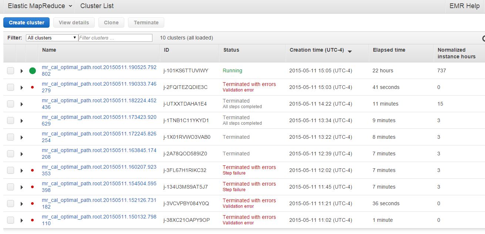

 * Amazon EMR Map Reduce job status page

 Here is the EC2 page view while the EMR job is running. We can see the CPU utilization for the selected instances are all saturated. This is within expectation because the job we are running is 100% CPU intensive. There is not much disk IO or network IO throughput, which is also as expected.

 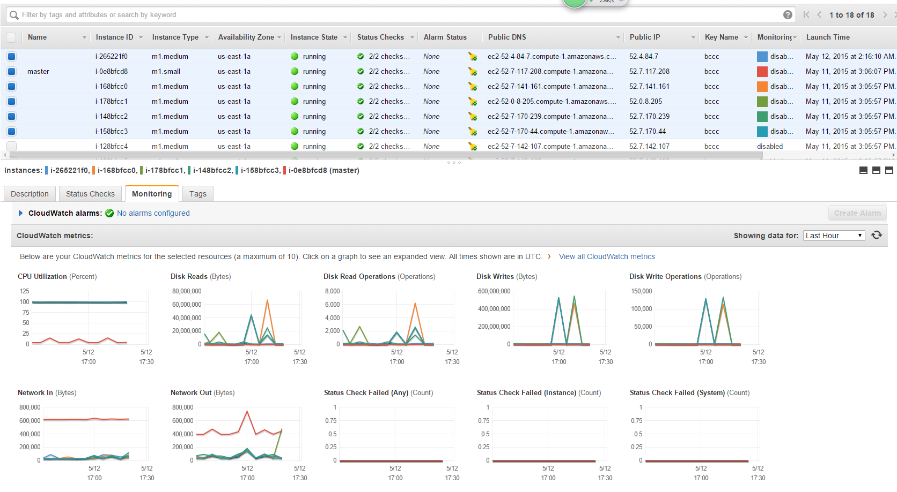

 * Hadoop status page

 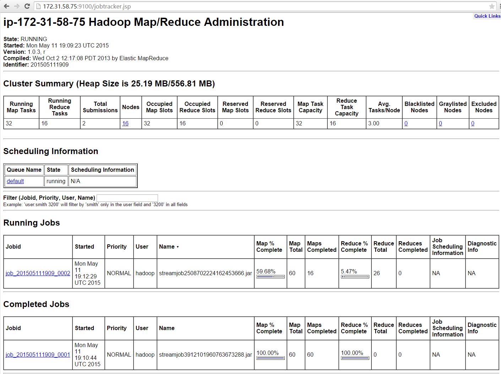

 * Hadoop map and reduce job progress

 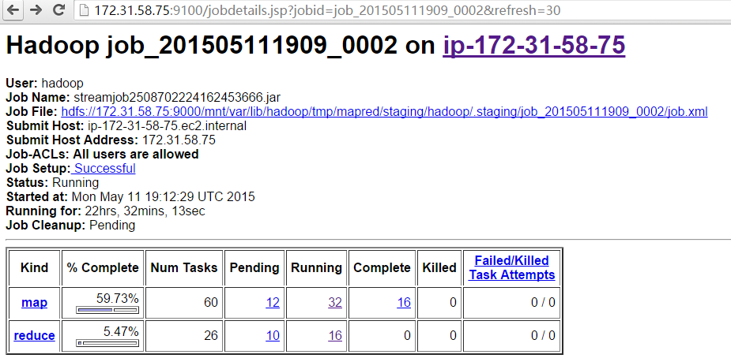

 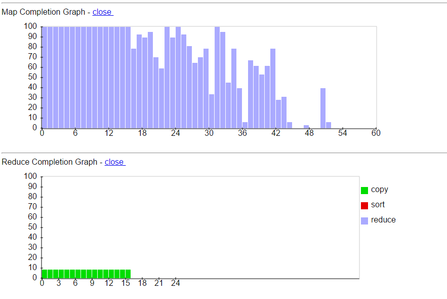

Here are a few screen captures after the job is done. The full job takes 2 days and 20 hours to finish.

 * Amazon EMR Map Reduce job status page

 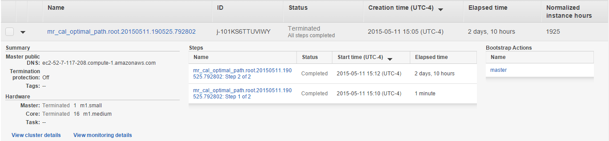

 * Amazon EMR Map Reduce job detail page

 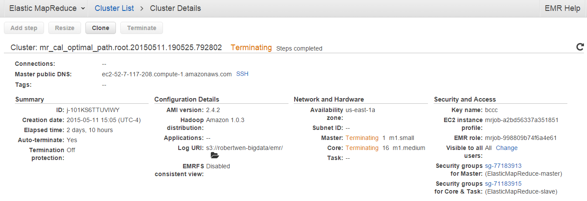

 * Amazon EMR Map Reduce job monitor page

 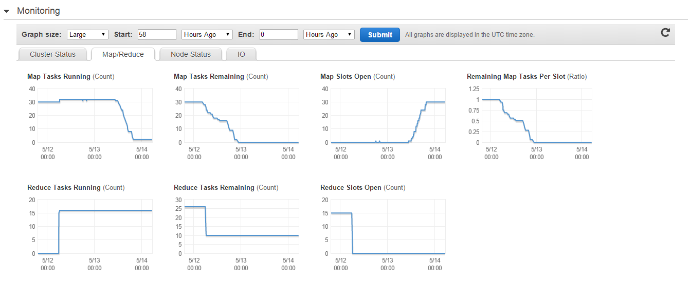

 * Hadoop status page

 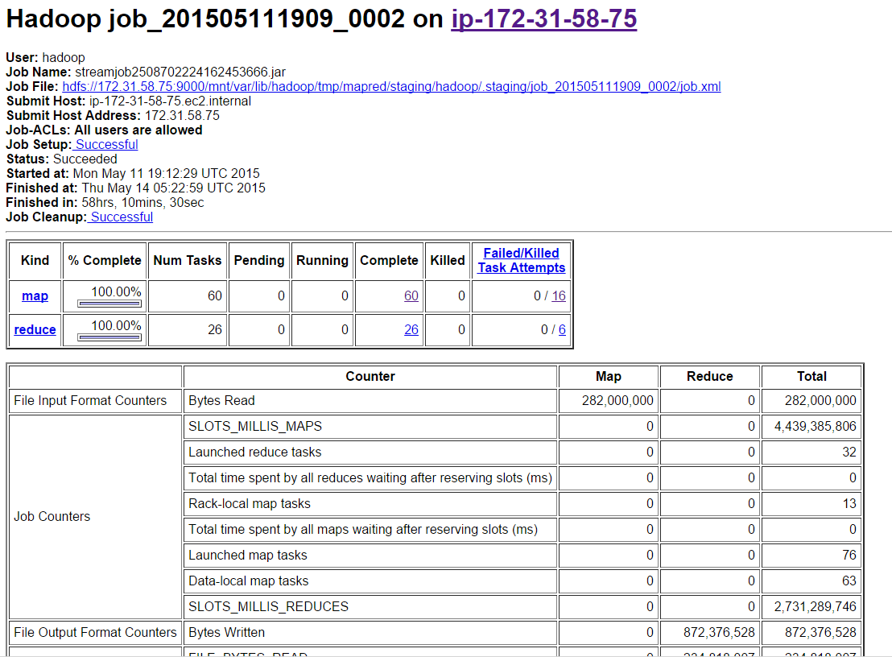

 * Hadoop map and reduce job progress

 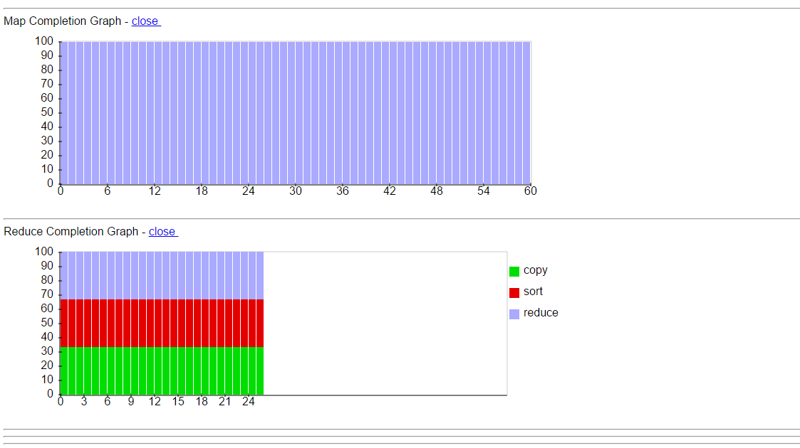

Here are the screen shots for the input and output files on S3

 * Input files on Amazon S3

 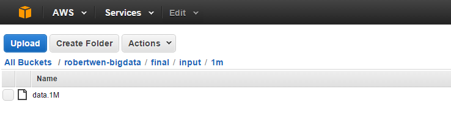

 * Output files on Amazon S3

 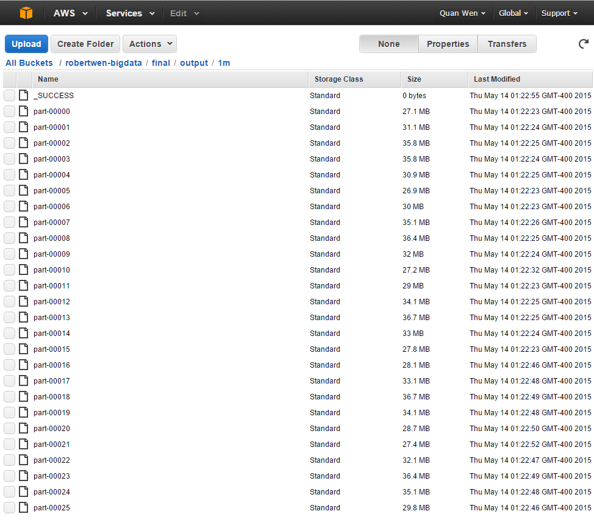

### Data Importing

The following bash script is used to import the map-reduce generated output data to a MongoDB database.

```bash
DATABASE="camelot"
COLLECTION="smartcache"

if [ $# -lt 1 ]
then
  echo "Need files to be imported!"
  exit 2
fi

echo "db.dropDatabase()" | mongo $DATABASE

while [ $# -gt 1 ]
do
  INFILE=$1

  if [ ! -f "$INFILE" ]
  then
    echo "$INFILE does not exist!"
    shift
    continue
  fi

  shift

  mongoimport -d $DATABASE -c $COLLECTION --type json --file $INFILE
done
```

 There are 26 output files from the EMR map-reduce. These are the input files for the importer script.

 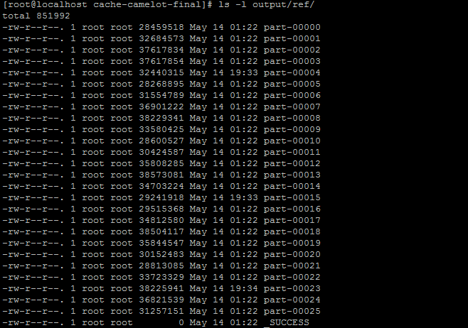

 As we can see, it takes 3 minutes 35 seconds to import data for 1,000,000 canvass map results.

 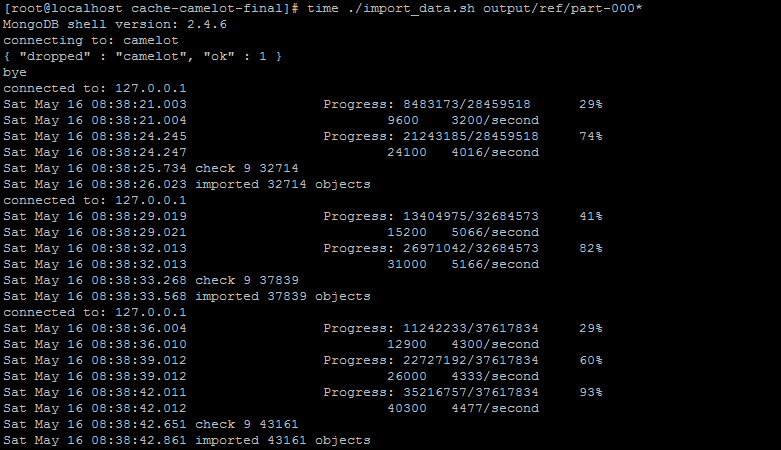

 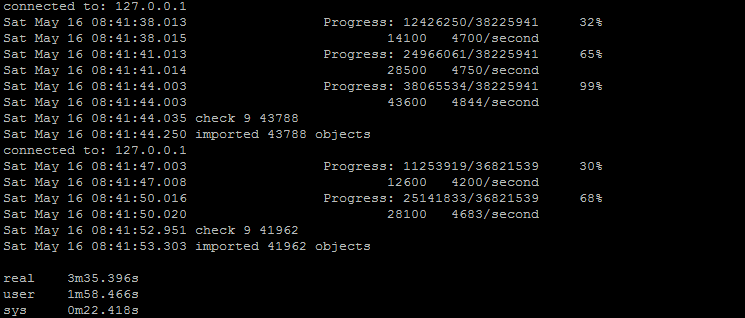

### Data Retrieving

query_cache.py script is a quick query utility to check the cache in the MongoDB

Given a canvass map hashid, with the desired level and side info, we can query the path info from the cache database in the MongoDB.
```bash
# python query_cache.py -k 404142434445X121314152332 --level 1 --side north
[[4, 2], [2, 2], [0, 4], [2, 6]]
# python query_cache.py -k 404142434445X121314152332 --level 2 --side south
[[1, 2], [0, 3]]
```

### Data Visualization

With the path info retrived from the cache, we can manually check the coordinates on the game canvass and figure out how to move the game pieces on each side, which is not very straighforward. We go one step further to visualize the game piece movement in a GIF animation. 

Here is one example of the game move with the starting game canvass of "424344455354X727475767782"

* Path movements
 * [4, 3] -> [6, 3]
 * [6, 3] -> [8, 1]
 * [8, 1] -> [8, 3]
 * [8, 3] -> [6, 5]
 * [6, 5] -> [8, 5]
 * [8, 5] -> [6, 7]
 * [6, 7] -> [8, 7]

* Canvass Evolution
 * move0: "424344455354X727475767782"
 * move1: "424445535463X727475767782" 
 * move2: "424445535481X747576778200"
 * move3: "424445535483X747576770000" 
 * move4: "424445535465X757677000000"
 * move5: "424445535485X767700000000" 
 * move6: "424445535467X770000000000"
 * move7: "424445535487X000000000000"

* R Plotting script

 Here is the plotting script written in R
```R
# library to draw circles
library(plotrix)
# library to filter data frame
library(dplyr)

# echo OFF
options(echo=FALSE)

#
# check whether one (x,y) is in the list of cell locations
#
is_cell_in_list <- function(cell, cell_list) {

  off_x = cell[1]
  off_y = cell[2]

  cc <- filter(cell_list, x==off_x & y==off_y)
  ret <- (nrow(cc) > 0)

  return(ret)
}

#
# convert the hash mapkey to a list of cell locations
#
convert_hash_mapkey <- function(mapkey) {

  loc1 <- substr(mapkey, 1, 2)
  loc2 <- substr(mapkey, 3, 4)
  loc3 <- substr(mapkey, 5, 6)
  loc4 <- substr(mapkey, 7, 8)
  loc5 <- substr(mapkey, 9, 10)
  loc6 <- substr(mapkey, 11, 12)

  for (loc in c(loc1, loc2, loc3, loc4, loc5, loc6)) {
    off_x = strtoi(paste('0x', substr(loc, 1, 1), sep=''))
    off_y = strtoi(paste('0x', substr(loc, 2, 2), sep=''))

    loc_xy = c(off_x, off_y, 'north')

    if (exists("map_cell_list") == FALSE) {
      map_cell_list <- c(x=off_x, y=off_y, side='north')
    } else {
      map_cell_list <- rbind(map_cell_list, loc_xy)
    }
  }

  loc1 <- substr(mapkey, 14, 15)
  loc2 <- substr(mapkey, 16, 17)
  loc3 <- substr(mapkey, 18, 19)
  loc4 <- substr(mapkey, 20, 21)
  loc5 <- substr(mapkey, 22, 23)
  loc6 <- substr(mapkey, 24, 25)

  for (loc in c(loc1, loc2, loc3, loc4, loc5, loc6)) {
    off_x = strtoi(paste('0x', substr(loc, 1, 1), sep=''))
    off_y = strtoi(paste('0x', substr(loc, 2, 2), sep=''))

    loc_xy = c(off_x, off_y, 'south')
    map_cell_list <- rbind(map_cell_list, loc_xy)
  }

  map_cell_list <- data.frame(map_cell_list)
  return(map_cell_list)
}

draw_a_cell <- function(cell_info) {

  off_x = strtoi(cell_info[1,1])
  off_y = strtoi(cell_info[1,2])

  if (off_x == 0 & off_y == 0) {
    return()
  }

  draw_off_x <- (40 + (off_y) * 40)
  draw_off_y <- (40 + (13-off_x) * 40)

  side = cell_info[1,3]
  if (side == "north") {
    color <- "white"
  } else {
    color <- "black"
  }

  draw.circle(draw_off_x, draw_off_y, 18, border=color, col=color)
}

# argument parsing and get cell list in data frame
args <- commandArgs(trailingOnly = TRUE)
mapkey <- args[1]
output_png <- args[2]
n_moves <- as.integer(args[3])
i_moves <- as.integer(args[4])

print(i_moves)

if (output_png == "") {
  output_png <- 'canvass.png'
}

cell_map_list <- convert_hash_mapkey(mapkey)

# set target output file
png(output_png, width=360, height=600)

# draw the game canvass
plot(c(0,360), c(0,600), axes = F, xlab = NA, ylab = NA)

# disabled cells are here
disabled_cells <- rbind(c(x=0,y=0),              c( 0,1), c( 0,2), c( 0,5), c( 0,6), c( 0,7))
disabled_cells <- rbind(disabled_cells, c(1, 0), c( 1,1),                   c( 1,6), c( 1,7))
disabled_cells <- rbind(disabled_cells, c(2, 0),                                     c( 2,7))
disabled_cells <- rbind(disabled_cells, c(11,0),                                     c(11,7))
disabled_cells <- rbind(disabled_cells, c(12,0), c(12,1),                   c(12,6), c(12,7))
disabled_cells <- rbind(disabled_cells, c(13,0), c(13,1), c(13,2), c(13,5), c(13,6), c(13,7))
disabled_cells <- data.frame(disabled_cells)

# draw all cells
for (x in 0:13) {
  for (y in 0:7) {
    if (is_cell_in_list(c(x,y), disabled_cells) == FALSE) {
      if ((x %% 2 == 0 & y %% 2 == 1) | (x %% 2 == 1 & y %% 2 == 0)){
        color <- "bisque1"
        rect(20 + y * 40, 20 + x * 40, 60 + y * 40, 60 + x * 40, col=color)
      } else if ((x %% 2 == 0 & y %% 2 == 0) | (x %% 2 == 1 & y %% 2 == 1)){
        color <- "burlywood3"
        rect(20 + y * 40, 20 + x * 40, 60 + y * 40, 60 + x * 40, col=color)
      }
    }
  }
}

# draw white and black cells
nrows <- nrow(cell_map_list)
for (i in 1:nrows) {
  draw_a_cell(cell_map_list[i,])
}

# draw the indexes
for (row in 0:13) {
  # left
  text(x = 0, y = 40 + (13 - row)*40, labels = toupper(as.hexmode(row)))
  # right
  text(x = 360, y = 40 + (13 - row)*40, labels = toupper(as.hexmode(row)))
}

for (col in 0:7) {
  # bottom
  text(x = 40 + col * 40, y = 0, labels = toupper(as.hexmode(col)))
  # upper
  text(x = 40 + col * 40, y = 600, labels = toupper(as.hexmode(col)))
}

# add title and description
if (i_moves == 0) {
  title(main = "Camelot Game Canvass Map", sub = paste("MAPHASH:", mapkey), outer = FALSE)
} else {
  title(main = "Camelot Game Canvass Map", sub = paste("MAPHASH:", mapkey, "move", toString(i_moves), \
               "of", toString(n_moves-1)), outer = FALSE)
}

dev.off()
```

* Game movement in GIF animation

 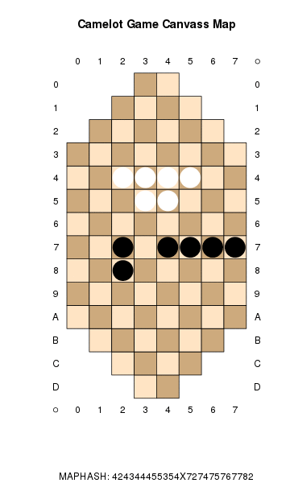

### Game Benchmark

Here we design a benchmark to test the performance gain from the cache. We select one complete game play from beginning to end for each difficulty level for the white player only.

Here is the benchmark for the level1 game play:

 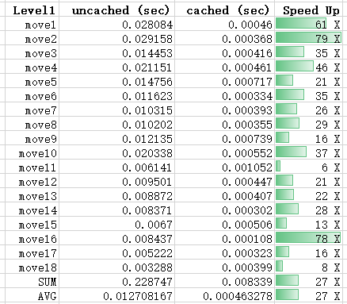

 As we can see from the above data, there are 18 moves in this game, with total thinking time of 0.23s and average thinking time of 0.008 sec.
 The speed up from the cache varis from 6x to 79x, with the average speed up of 27x.
 With the cache, the total thinking time is 0.0083s, with average thinking time of 0.00046s.

 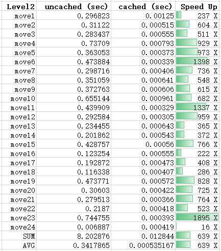

 As we can see from the above data, there are 24 moves in this game, with total thinking time of 8.2s and average thinking time of 0.013 sec.
 The speed up from the cache varis from 16x to 1895x, with the average speed up of 639x.
 With the cache, the total thinking time is 0.0128s, with average thinking time of 0.00053s.

 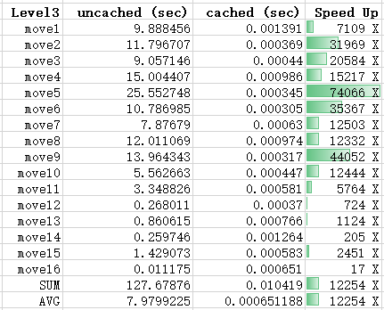

 As we can see from the above data, there are 16 moves in this game, with total thinking time of 127s and average thinking time of 7.980 sec.
 The speed up from the cache varis from 17x to 74066x, with the average speed up of 12254x.
 With the cache, the total thinking time is 0.010s, with average thinking time of 0.00065s.

 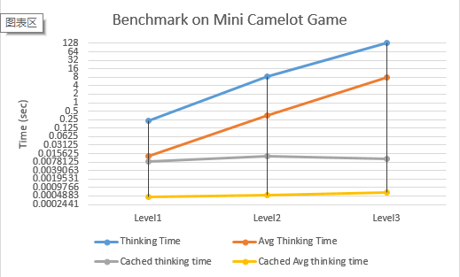

 As we can see from the above data, the thinking time as well as average thinking time increase linearly while the game difficulty level grows. However the cache retrieval time is almost constant across different game levels. That is to say, the higher level we play the game, the gain in the speed up is more. As we can see from earlier data, we have got a 40000+ times faster from the move5 on difficulty level3.

### Summary

In this project we have used the following technology to achieve the two objectives:

 * Data preparation part is implemented in Python
 * Machine learning part is not fully implemented. 
 * Big Data part is implemented in Python with MRJob library and it is run on Amazon EMR cloud service
 * Query part is implemented in Python with Django web framework
 * Visualization part is maily implemented with R but is also combined with Python for GIF animation generation

### Opportunities

The ultimate goal for this game cache layer is to achieve 100% cache hit rate, with acceptable user response time. 

In order to achieve this, we have discussed the impossibility to cover all the game canvass scenarios with reasonable resource in the current technology trend. Dispite of this, increasing the number of cache entries would still increase the probability of cache hit. From this approach, we need to increase the number of computing nodes when doing the pre-calculation map-reduce on Amazone EMR. In the 1 million data sample in this projects, we spent about 58 hours on 16 nodes. Preferrably we would like to run 64-128 nodes so we can reduce the elapsed time to less than 10 hours for the 1 million data items.

Now that we cannot cover all the game canvass scenarios, we will need to optimize our filtering model to keep the most effective game canvass in the cache. As this is a trained model, we will need more training data. With the single machine mini camelot game, it is difficult to collect a good amount of training data with only one human game player. Also with limited human player, it is difficult to get training data with variety in terms of moving habits and strategies. If the game could be extended to an online version, with more human players, it will be much easier to collect a lot of good training samples in a short period of time. Then with sufficient real game play data, we could train a better filtering model to increase the cache hit rate.

### MANIFEST

* MANIFEST.md
 * The current file, explaining the usage of the files and directories under this project

* README.md
 * High level introduction about this project

* draw_canvass.R
 * An R script to draw the game canvass from the game canvass hashkey

* gen_gif.py
 * generate animated GIF

* mr_cal_optimal_path.py
 * A MRJob map-reduce script to generate the game moving results

* playcc.py
 * Core game engine, from Artificial Intelligence course project
 * We use the whats_next_move() function to calculate the result for this project
 * Credit is with Caicai CHEN <caicai.chen@nyu.edu>

* tkui.py
 * Core game ui, from Artificial Intelligence course project
 * Credit is with Caicai CHEN <caicai.chen@nyu.edu>
 * This file is not actually used, but is the dependency to run the game engine

* try_gen_sample.py
 * An experimental script to generate the canvass map data

* import_data.sh
 * data importer script to import data into MongoDB

* query_cache.py
 * query the MongoDB with specified mapkey, level and side info

* Makefile
 * Makefile, only make clean is available.

* images
 * images for this report

* input
 * test input data

* output
 * test output data

* data
 * path test data
 * game benchmark data

* ml_filtering
 * the machine learning filtering for the raw data

* aws
 * aws keys
 * emr configuration

### Acknowledgement

The Mini Camelot game path calculation algorithm code is from my friend Caicai CHEN <caicai.chen@nyu.edu> in her Artificial Intelligence course project. The algorithm was not modified at all but was with some interface change in order to accommodate the map reduce framework.

Also thanks go to both Professor Juan and Professor Raman who teach this Big Data Analytics course. This course offers flexibility not only on the course schedule but also on the course homework and project. This is what I liked most in this course, because with different background on almost everyone, it is not wise to have the same criteria for the homework or project. This gives me the freedom to make best use of my knowledge and skill to accomplish the assigned tasks. The 100 USD credit on AWS also gives student a real world computing environment to try and learn this course. Although I ran out of the budget on the big AWS EMR on this final project, I think it worthed the learning. I am kind of new to Big Data Analytics and in the past few months I learned a lot from this course.

