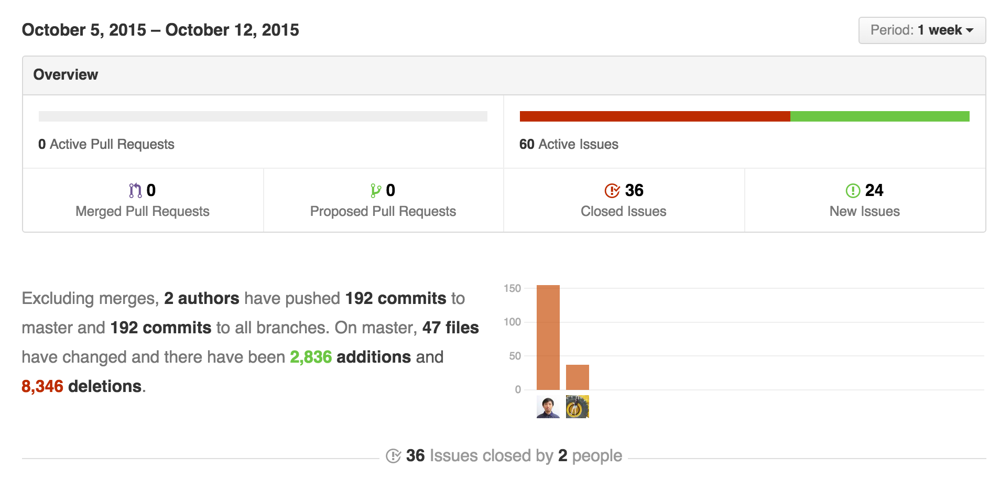

## Inverted Index Generator

Robert Wen <robert.wen@nyu.edu>  Caicai Chen <caicai.chen@nyu.edu>

#### Introduction

This project is the 2nd programming assignment of the Web Search Engine class for Fall 2015 Semester at Tandon School of Engineering, NYU. It is about building an inverted index generator based on web crawled data. It is the collaboration effort of Robert Wen and Caicai Chen, with the consent of Professor Torsten.

There are two set of web crawled data: NZ dataset and the CommonCrawl dataset. The NZ dataset is with a few million web pages crawled a few years ago for all the New Zealand websites. The CommonCrawl dataset is humongous. For the subset of July 2015 data it's a few dozen TB in crawled data. For this assignment, we select 0.25% of the July 2015 CommonCrawl data for inverted index generation. It is about 80 * 50000 = 4 million pages with about 80 * 150MB = 12GB compressed crawled data.

In this programming assignment, we have achieved to index 4 million docs from CommonCrawl in 40 minutes. This document describes the design and the implementation of the inverted index builder.

#### How to build and run

* How to build the program


* How to run the program


#### Core features of the indexer

 * High-throughput
  * indexed 4 million documents in 40 minutes
  * 27 docs/sec indexing throughput

 * IO efficient
  * use word id to compress the index
  * use relative offset to doc to compress the index
  * use double relative offset to further compress the index, with 60% saving
  * use ?? to compress the offset further

 * Ease of Use
  * Single binary launch with single parameter
  ```bash
  $ ./iigen --basedir=/data/wse/1m
  ```
  * input is assumed to be in a dir named "input" under that directory
  * output will be placed in a dir named "output" under that directory

 * Flexible input format
  * support both .gz and uncompressed format

 * Incremental indexing
  * with our multi-level index format, we can have minimal index data merging during incremental indexing

 * Multi-phase indexing
  * we can do one-step indexing for effiency
  * we can also do step-by-step indexing for debug and learning purpose

 * Heavily tested
  * tested in 4 varied-sized common crawl datasets
  * crossed validation with C and Python implementation
  * verified on laptop and also on Google Cloud and Amazon AWS

#### Terms

  * file
   * a WET file in WARC format, either gz compressed or uncompressed
  * doc
   * a crawled page saved in the WET file as a WARC record
   * also known as a page as it is a web page
   * there is a unique docid associated with a doc/page
   * there is a url associated with this doc/page
   * We refer doc in the futher part of the doc
  * word
   * there are many words in one doc
   * word may be duplicated in one doc or across docs
   * each unique word has an unique word id
   * word id is tracked globally across all docs and files
  * lexicon
   * parsed from the doc for a word, with its assocated docid, wordid
  * inverted index
   * a type of index to query a word back to a page

#### Architecture

 We implemente the indexer with multiple phases.

 

 * warc parsing
  * INPUT: a list of WET files
  * OUTPUT: a list of parsed WARC records in those files

 * lexicon generation
  * INPUT: a list of parsed WARC records
  * OUTPUT: unsorted lexicon files, one WET file to one lexicon

 * lexicon sorting
  * INPUT: unsorted lexicon files
  * OUTPUT: sorted lexicon files, one lexicon to one lexicon

 * index generation
  * INPUT: sorted lexicon files
  * OUTPUT: one inverted index, with three files
            1. global index table (GIT)
            2. middle index table (MIT)
            3. inverted index (IIDX)

 * index merging
  * INPUT: a series of inverted index set(3 files)
  * OUTPUT: merged inverted index set into buckets
   * only GIT and MIT will be merged
   * IIDX will remain

 * index bucketing
  * This actually happens inside the merging
  * GIT and MIT will be placed into buckets according to its procedding character
  * IIDX will remain in its original place

#### Task Breakdown
 
This document is written in collaboration. For the code implementation, here is the breakdown for each phase: 
 * warc parsing (Robert Wen, for both Python and C implementation)
 * lexicon generation (Robert Wen, for both Python and C implementation)
 * lexicon sorting (Robert Wen, for both Python and C implementation)
 * index generation (Caicai Chen for C implementation, Robert Wen for Python implementation)
 * index merging (Caicai Chen)
 * index bucketing (Caicai Chen)

#### Core Data Structure

There are a few core data structures we use for the inverted index building.

 * URL Table
  * We use id to represent the url. In this document and the project, we use docid to represent the id of the url as each url associates with one doc, also known as a web page.
  * docid generation is straight-forard.

 * Word Table
  * We also use word id in lexicon generation so the data in lexicons will be simplified. In order to use word id, we have to generate unique word id for each occurring word in the documents.
  * word id is generated when a new word comes. In order to track this, we build a hash tree to track the occurrence of the new word. word id starts with 1. If it is a new word occurrence, a new word id will be generated incrementally and assigned to that word. Otherwise, the existing word id will be retrieved from the hash tree.
  * in order to store the word id, we use the following posting format
   * INDEX table
    * [number 4B][offset 4B]
   * DATA table
    * [word  ][word ][word with varied length]
  * in this way, once we have the word id, we can use O(1) time to fetch its offset in the data file, and use another O(1) time to fetch the actual character represenation of the word. The total retrival time is still O(1) considering there is no linear search through the list.

 * Lexicon
  * FILE POSTING FORMAT:
   * [WORD_ID][DOC_ID][OFFSET]

 * Multi-level Inverted Index
  * Global Index Table
   * FILE POSTING FORMAT:
    * [WORD_ID][OFFSET1][N]
  * Middle Index Table
   * FILE POSTING FORMAT:
    * [DOC_ID][OFFSET2][N]
  * Offset Index Table
   * FILE POSTING FORMAT:
    * [OFFSET][OFFSET3][OFFSET]

  * OFFSET1: the offset for this word in the Middle Index Table
  * OFFSET2: the offset for this word/doc in the Offset Index Table
  * OFFSET3: the offset for this word/doc with a specific occrrence in the wet file, relative to its doc content start

#### Lexicon Building

 * Decompression
  * WARC file is provided with .gz format. We handle both .gz and .wet file for processing. If the file is compressed, it will be decompressed first and read into the memory for processing.
  * We use zlib to process the .gz format.

 * WARC Parsing
  * WARC is a standard protocol to store and archive web contents. We write our own parse to parse the WARC protocol from the uncompressed data.
  * We referenced the Python warc library to reimplemente the C parser, and parsed WARC record for further lexicon processing.

 * Lexicon Parsing
  * The payload of each WARC record is the page content.
  * As we use the WET data, the data is stripped out with the HTML tag.
   * Pros of the WET data
    * For simplicity. No need HTML parser
    * For IO efficiency. Less data less IO. It is about 50% size of the
    * For processing efficiency. Lexicon parsing is much easier and faster.
   * Cons of the WET data
    * No context of the lexicons

 * Lexicon Sorting
  * We use qsort() in the memory to in-place sort the lexicons and write them back to disk.
  * It is O(n.logn) time complexity and O(1) space complexity

#### Index Building

 * Initial Index Building
  * Since sorted lexicon has the format for each record: [WORD_ID][DOC_ID][OFFSET]
   * Same word occured several times
   * Same doc with same word occured several times
  * After constructint Index:
   * One word occured once in .git file, followed with offset in .mit file, point to docs contain the word 
   * One doc for each word occured once in .mit file, followed with offset in .iidx file, point to places of this word occured in this doc
  * Compress offset of word in each doc by only record difference with its previous one.

  * INPUT: sorted lexicon file
  * OUTPUT: inverted index(three files):
     * .git  : [WORD_ID][OFFSET][N_DOCS]
     * .mit  : [DOC_ID][OFFSET][N_PLACES]
     * .iidx : [OFFSET]

  * For example:
   * Sorted lexicon:

	word_id | doc_id | offset
	:------:|:------:|:----:
		1   |    1   |  1
		1   |    1   |  3
		1   |    1   |  4
		1   |    2   |  1

   * .git:

   	word_id | offset | n_docs
  	:------:|:------:|:----:
	  	1   |    0   |  2

   * .mit:

   	doc_id | offset | n_places
	  :------:|:------:|:----:
	  	1   |    0   |  3
	  	2   |    3   |  1


   * .iidx:

    word_id |  
	  :------:|
	    	1   |
	    	2   |
	    	1   |
	    	1   |


 * Index Merging
  * INPUT: List of (.git, .mit) files need to be merged.
  * OUTPUT: one pair of (.git, .mit) file.

  * Define how many ways to merge, like 8-way, merge at most 8 files each time.
  * Define how much memory space to use.
  * Rewrit .git file and keep one record of same word, add up n_docs, update offset in .mit.
  * Rewrit .mit file, let all docs with same word together.
  * Keep .iidx the same, since these files are large so that it's time consuming to merge together, and it's easy to maintain when updating index. 


#### Benchmarks

 Performance matter as it means how much data you can process for this assignment. Due to the time constraint, we only target 4 million docs to index for the assginment submission.

 We have 4 datasets for benchmarking this indexer

 * tiny (3 WET files with 30 docs)
 * small (2 WET files with 100k docs)
 * medium (20 WET files with 1 million docs)
 * large (80 WET files with 4 million docs)

 The way we measure the performance is simple. We use the time command under macos/Linux to measure the run time. The elapsed time is taken for this metrics.

##### Tiny 30
 The tiny dataset is stripped from part of the July 2015 Common Crawl dataset. It is mostly for development and functionality validation purpose. The dataset is not quite useful for performance measurement as it is too small and the whole process finishes so fast in less than one second. Here is a reference number for each phase.

 - lexicon generation  0m0.095s
 - lexicon sorting     0m0.043s
 - index generation    0m0.223s
 - index merge         0m0.006s

 Due to the small amount of time running, there will be big variance in run time when some other processes are running on the same system. Hence it is not a good reference wordload for benchmarking.
 
##### Small 100k
 The small dataset with 100k docs are from 2 unstripped WET files in July 2015 Common Crawl dataset. Each WET file has approximately 50k docs so we have 100k in total. The input dataset is about 470 MB in size.

 Here is the data we collected from our earlier implementation. For quick prototyping, we implemented the first three phases in Python due to the availability of WARC library and easy programming. The whole process takes about 20 minutes.

 - lexicon generation  3m00.881s
 - lexicon sorting     5m24.454s
 - index generation   12m22.024s
 - index merging          4.544s

##### Medium 1m
 The medium dataset with 1 million docs are from 20 unstripped WET files in July 2015 Common Crawl dataset. Each WET file has approximately 50k docs so we have 1 million in total. The input dataset is about 4.7 GB in size.

 Here is the data we collected from our earlier implementation in Python as well. As we can see, the run time is almost linearly growing as the input grows 10 times. The whole process takes a little bit more than 2 hours to complete, which is also fine. But from this estimation it will take more than 20 hours for us to index 10 million documents. And it will take about 3 months to index 1 billion documents.

 - lexicon generation  30m19.675s
 - sorting(python)     57m27.198s
 - index generation    35m50.940s
 - index merging        1m28.378s

 So we re-implemented all phases in C. In the current implenetation, we merged the lexicon generation and sorting in one phase and directly generate the sorted lexicon files. Then we have this performance data.
 - lexicon generation   7m54.576s
 - index generation       40.341s
 - index merging         1m6.245s

##### Large 4m
 The large dataset with 4 million docs are from 80 unstripped WET files in July 2015 Common Crawl dataset. Each WET file has approximately 50k docs so we have 4 million in total. The input dataset is about 19 GB in size.

 With the latest implementation, we have the following performance data

 - lexicon generation  32m10.631s 
 - index generation     3m8.080s 
 - index merging        3m1.799s 

#### Technical Statistics
 * Code deliverables 
 ```bash
$ utils/count_source.sh
 h file:   180
md file:   329
py file:   895
 c file:  1811
--------------
  totol:  3215
 ``` 

 * Github statistics
  

 * Issue open/closed
  * We break down the development of this indexer to 3 milestones
   * alpha
    * 14 issue closed
   * beta
    * 3 issue closed
   * release
    * 14 issue closed

#### Known Issues

 * merge does not work with 8 GB memory buffer size
  * There should be some logic error in the code when handling buffer with 8GB. Due to the time constranit and the ability to work with 4GB buffer size, we decide to defer this resolution. The sacrifice is the under utilization of the system memory.

 * merge will fail unnicely when disk is full
  * We happended to run into disk full issue. The code is not handlling this exception well.

 * intermediate files are not removed after final index merge
  * Although this is not hard to implemente, we leave all the files in all phases for debugging purpose. Finally those files could be removed after final phase to save space. Maybe we should add a debug switch to leave those files.

#### TODO

There are tons of features we can do for the indexer. Here are a few items we think of most importance and interest to us if we still have time to improve this indexer.

 * More compression in index
  * We can probably compress the docid
  * We can probably compress the word id
  * We can use more aggressive compression algorithm to compress the offset numbers

 * Utilize large memory
  * Fully utilize the system memory by loading as much data as possible for both read and write buffer
  * For example, for the first phase, we can hold the full output in the memory

 * Utilize multi-core with paralleled processing
  * The avalability of multi cores in the laptop and the server instances on AWS are under-utilized with the single threaded indexing model
  * For lexicon generation, each document could be processed separately in a thread, provided there is no IO bottleneck. In the real world, we could not parallel too many threads due to the IO bottleneck. The number of threads should be tuned to a best number with a given computing environment but it should not be one.
  * For index generation, it could also be paralleled because the single index is not dependent with each other. 
  * For index merging, with N way merge, it also could be paralleled and speed the whole process up.

 * Distributed processing
  * Due to the IO bottleneck on single computing instance and the fact of impossibilities of fully utilizing the computing power, distributed processing with lower computing power but high IO fit into the model pretty well. With hadoop like technology, we can launch multiple processes in more than one instances and have access to a single shared storage with high which has IO throughput. Then the whole process could be paralleled in a very smoooth way. The only dependency is a shared 

 * Handle Larger dataset
  * The maximum dataset we have tested is with 4 million docs. Although it may work with more docs, there must be structral defect and deficiency when handling a larger number of docs.
  * For example, we need to bucket the word id when the word set grows to a certain amount, say 10 million
  * For example, we need to bucket the doc id when the doc grows to a certain amount, say 10 million
  * Otherwise, the global url table and word table will be very huge

#### File list
Here is the source file list for reference. Most of the file names are self explanatary.
```bash
$ tree .
.
├── Makefile
├── checklist.md
├── docs
│   ├── benchmarks.md
│   ├── design.md
│   ├── dev.md
│   ├── ideas.md
│   └── images
│       ├── github-stats-indexer.png
│       ├── how-to-build.png
│       ├── how-to-run.png
│       └── iindex_framework.png
├── finlist
├── gen_iindex.py
├── gen_lexicon.py
├── iigen.c
├── iigen.py
├── iigen.yml
├── iindex.c
├── iindex.h
├── lexicon.c
├── lexicon.h
├── merge.c
├── merge.h
├── readme.md
├── requirements.txt
├── sort_lexicon.py
├── test_data
│   ├── input
│   │   ├── input1.warc.wet
│   │   ├── input2.warc.wet
│   │   └── input3.warc.wet
│   └── output
│       ├── input1.warc.wet.lexicon
│       ├── input2.warc.wet.lexicon
│       └── input3.warc.wet.lexicon
├── tests
│   ├── read.c
│   ├── test_chk_iindex_files.py
│   └── test_chk_sorted_lexicons.py
├── tokenizer.c
├── tokenizer.h
├── utils
│   ├── chk_lexicons.py
│   ├── chk_word_table.py
│   ├── count_source.sh
│   ├── gen_list.sh
│   └── search_keyword.py
├── utils.c
├── utils.h
├── warc.c
└── warc.h
```
#### References

 * tokenizer
  * https://github.com/alexandermtang/tokenizer/blob/master/tokenizer.c
  * we used the above tokenizer from Github
  * but we also found a memory corruption bug when porting it to Linux. I guesss it is developed on MacOS as we develop as we also do not run into that Segmentation Fault error on MacOS.
  * A Pull Request will be made to the author of the code

 * WARC parser
  * https://github.com/internetarchive/warc
  * we used this in the python implementation
  * and refered this implementation to re-write our C based warc parser in warc.c and warc.h
  * we anticipate to continue polish this a bit and open source as a warc C parsing library as this is not generally available on the net/github.

